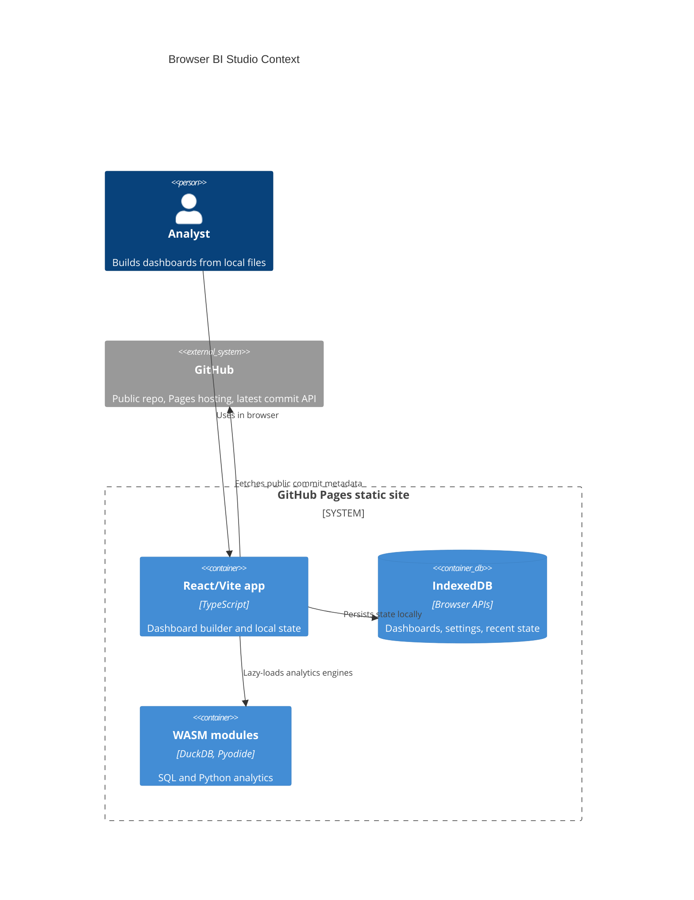

# Browser BI Studio

Live app: https://baditaflorin.github.io/browser-bi-studio/

Repository: https://github.com/baditaflorin/browser-bi-studio

Browser BI Studio is a fully client-side dashboard studio for local data exploration with WASM analytics, charts, embeddings, and local AI helpers.

## Why

Tableau Creator costs corporate teams about $900/year per user. Browser BI Studio tests the opposite premise: most v1 dashboard work can run from a static GitHub Pages app with user-owned files, browser storage, DuckDB-WASM, Pyodide, Plotly, Observable Plot, sentence-transformer embeddings, and optional local LLM assistance.

## Quickstart

```sh
npm install
make install-hooks
make dev
make build
make smoke
```

## What Works


- Load sample data, upload or drag/drop CSV, TSV, gzip CSV, and Parquet files, batch-import files, or paste CSV/TSV text.
- Query data in-browser with DuckDB-WASM.
- Build dashboard tiles with Plotly charts and Observable Plot previews.
- Autosave local dashboard state and settings in IndexedDB.
- Export result CSV/JSON, copy SQL or CSV, print, share small dashboard URLs, and import/export portable `.browser-bi.json` state files.
- Use lazy AI helpers for semantic search, Polars profiling through Pyodide, and optional in-browser WebLLM suggestions.
- See the app version and current `main` commit on the live page.

## Limitations

- URL import is guidance-only because most public data URLs block direct browser reads without CORS; download the file or paste table text instead.
- JSON and ZIP uploads receive actionable errors. Flatten JSON to a table or extract CSV files from ZIP archives first.
- Rich Phase 2 diagnosis is strongest for CSV, TSV, and gzip CSV. Parquet loads through DuckDB, but detailed delimiter/header inference does not apply.
- AI helpers may download public model assets on first use and can be slow on lower-memory devices.

## Architecture



More architecture detail: docs/architecture.md

ADRs: docs/adr/

Deployment guide: docs/deploy.md

Privacy notes: docs/privacy.md

## GitHub Pages

The production build is committed to `docs/` and served by GitHub Pages from the `main` branch.

Live URL: https://baditaflorin.github.io/browser-bi-studio/

## Security

No secrets belong in this project. The frontend never stores API keys, tokens, passwords, private keys, or hidden server credentials. Local files stay in the browser unless the user exports them.

Disclosure policy: SECURITY.md
