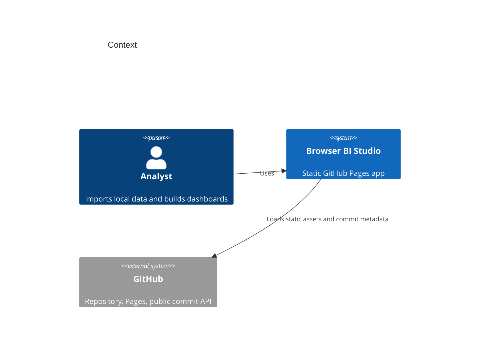
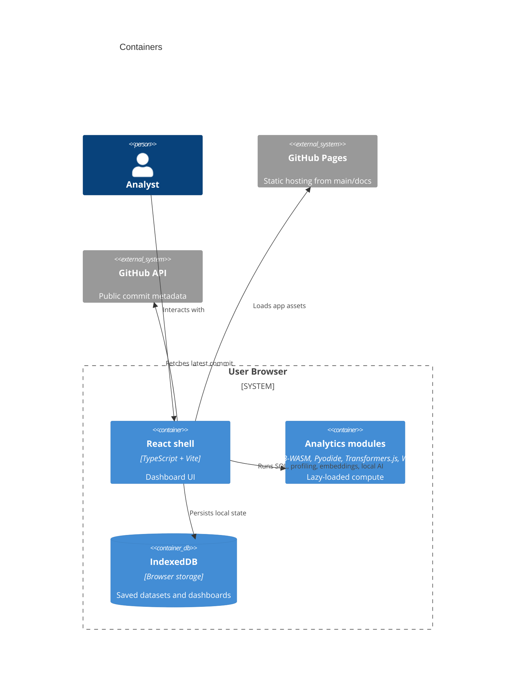

# Architecture

Browser BI Studio is Mode A: Pure GitHub Pages. The public surface is a static site hosted at:

https://baditaflorin.github.io/browser-bi-studio/

The repository is:

https://github.com/baditaflorin/browser-bi-studio

## Context

## Containers

## Boundaries

- No runtime backend exists.
- No authentication is required.
- Local user files remain in browser memory or IndexedDB unless exported by the user.
- Optional model downloads happen from public model CDNs only after the user starts an AI action.
